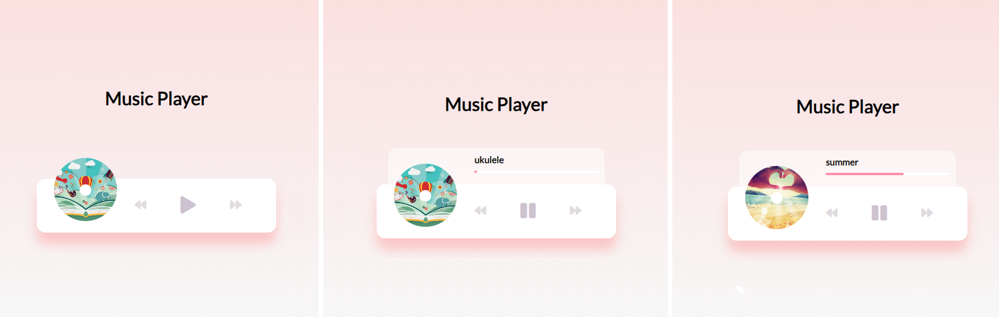
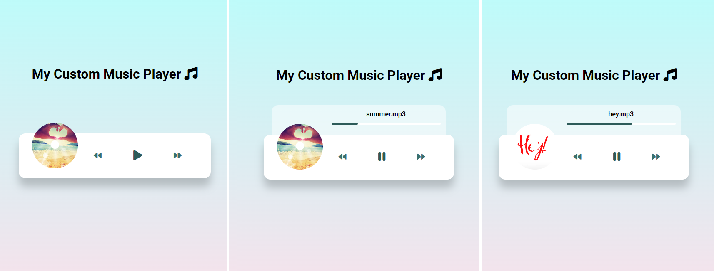

# Udemy--vanillawebprojects-10

**Tenth out** of a series of **20 small projects** in **Vanilla JavaScript** from the [**Udemy course**](https://www.udemy.com/course/web-projects-with-vanilla-javascript/) by author [Brad Traversy](https://www.traversymedia.com/) with this [Brad's original GitHub repository](https://github.com/bradtraversy/vanillawebprojects).

# 10: Music Player

Create beautiful UI to play music stored in the "music folder" using the HTML5 audio API

## Project Specifications

- Create **UI** for music player including **spinning imag**e and **song detail** popup
- Add **play** and **pause** functionality
- **Switch** songs
- **Progress bar**

## Original preview

    

## My solution preview

    

## My solution features

- Custom **UI/UX design**

# Author

Website - [Petr Bednarski](https://github.com/pettik)  
Frontend Mentor - [@pettik](https://www.frontendmentor.io/profile/pettik)
